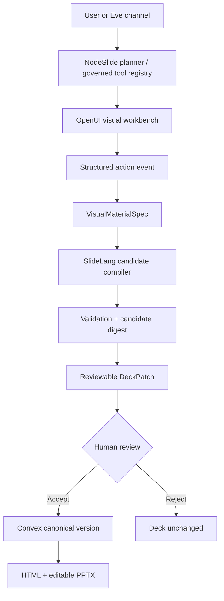

# NodeSlide × OpenUI × Eve — latest-state hierarchical summary checklist

Date: 2026-07-15 (America/Los_Angeles)  
Repository: `D:\VSCode Projects\parity-studio`  
Mode: read-only product/repository diagnostic; no production mutation, live-model call, or deployment

## Status legend

- [x] **PRESENT** — evidenced in the current working tree or current first-party documentation.
- [ ] **PARTIAL** — useful substrate exists, but the requested capability is incomplete.
- [ ] **MISSING** — no implementation or proof was found.
- [ ] **BLOCKED** — a prerequisite prevents an honest pass.

The working tree was already dirty and changed during inspection. This report maps the latest state
observed after the 2026-07-15 22:37 full test run; it does not claim that the uncommitted work is
reviewed, committed, deployed, or live.

## 0. Executive decision

- [x] **ADOPT:** use [Thesys OpenUI](https://github.com/thesysdev/openui) / OpenUI Lang as
  NodeSlide's interactive visual-research, material-selection, data-exploration, QA, and trace
  workbench.
- [x] **DO NOT ADOPT FOR THIS ROLE:** [W&B OpenUI](https://github.com/wandb/openui) is a
  prompt-to-UI prototyping application, not the intended NodeSlide agent-tool runtime.
- [x] **KEEP:** SlideLang remains the canonical presentation document, rendering, validation, HTML,
  and editable PowerPoint format.
- [x] **KEEP:** Convex remains authoritative for decks, sources, patches, versions, review decisions,
  traces, and durable hosted jobs.
- [x] **KEEP:** NodeSlide's planner/provider layer remains responsible for research and proposal
  planning. The repo uses `@earendil-works/pi-ai`; it does not yet prove a full iterative Pi agent
  tool loop.
- [x] **KEEP:** Eve remains an optional external operator shell for sessions, channels, schedules,
  connections, subagents, and sandboxed work. It must not become a second deck-state authority.
- [ ] **GO only for a compatibility spike:** do not present OpenUI or Eve as a production NodeSlide
  capability until the deterministic hero flow and a disposable staging flow pass the release bar in
  section 8.

### Target authority flow



## 1. External research mapped to current versions

### 1.1 Thesys OpenUI

- [x] **PRESENT:** `@openuidev/react-lang` is currently `0.2.8`, MIT licensed, and compatible with
  React 18.3/19 and Zod 3.25/4. The repo already uses React 19 and Zod 4, so the compatibility
  baseline is good. Evidence: [npm package](https://www.npmjs.com/package/@openuidev/react-lang).
- [x] **PRESENT:** `@openuidev/react-ui` is currently `0.12.1`, MIT licensed, but brings a broad
  generic UI stack including Radix packages, Recharts, Zustand, markdown, math, and its own Lucide
  range. Evidence: [npm package](https://www.npmjs.com/package/@openuidev/react-ui).
- [x] **DECISION:** start with exact-pinned `@openuidev/react-lang@0.2.8` plus the repo's existing
  Zod and NodeSlide design system. Do not import `@openuidev/react-ui` in phase 0.
- [x] **PRESENT:** OpenUI Lang's current documented language is v0.5: streamed assignment statements,
  reactive state, `Query`, `Mutation`, `@Run`, bindings, and incremental edit mode. Evidence:
  [v0.5 specification](https://www.openui.com/docs/openui-lang/specification-v05).
- [x] **PRESENT:** the renderer accepts either a function map or an MCP client as its tool provider;
  reactive queries can re-run without another model call. Evidence:
  [Queries & Mutations](https://www.openui.com/docs/openui-lang/queries-mutations).
- [x] **PRESENT:** incremental editing replaces same-name statements, adds new statements, and keeps
  omitted statements, which matches NodeSlide's no-clobber direction. Evidence:
  [Incremental Editing](https://www.openui.com/docs/openui-lang/incremental-editing).
- [x] **PRESENT:** the renderer exposes structured parser, query, mutation, runtime, and render errors,
  including `unknown-component`, `missing-required`, `tool-not-found`, `runtime-error`, and
  `render-error`. Evidence: [Renderer](https://www.openui.com/docs/openui-lang/renderer).
- [ ] **PARTIAL:** OpenUI's published token-efficiency figures are first-party benchmark results, not
  NodeSlide evidence. Reproduce them with NodeSlide components and deck tasks before repeating a
  public efficiency claim.
- [ ] **UNVERIFIED:** no current first-party OpenUI documentation was found for the pasted brief's
  specific “persistent Pi coding-agent session” example. Treat Pi alignment as architectural
  compatibility, not an OpenUI-supported integration claim.

### 1.2 Vercel Eve

- [x] **PRESENT:** Eve's current package version is `0.24.4`; the experiment pins that exact version.
- [x] **PRESENT:** Vercel's current Eve model still uses `instructions.md`, optional `agent.ts`,
  filesystem-discovered `skills/` and `tools/`, plus `sandbox/`, `channels/`, `connections/`,
  `subagents/`, and `schedules/`. Evidence: [Vercel Eve](https://vercel.com/eve).
- [x] **PRESENT:** Eve currently requires Node.js 24 or newer.
- [ ] **BLOCKED:** the inspected shell is Node `22.22.2`; the Eve TypeScript check passes, but an
  honest runtime/dev proof requires Node 24.

## 2. Current NodeSlide substrate

### 2.1 Canonical presentation and governance

- [x] **PRESENT:** SlideLang supports text, shape, image, chart, math, video, and connector elements
  (`shared/nodeslide.ts:139`, `shared/nodeslide.ts:223-289`).
- [x] **PRESENT:** HTML/PPTX capability reporting and compilation remain owned by the SlideLang
  adapter (`src/domains/nodeslide/slidelang/types.ts:14-113`).
- [x] **PRESENT:** scoped patch operations, CAS clocks, candidate digests, candidate validation, and
  reviewable patch status already exist (`shared/nodeslide.ts:348-466`).
- [x] **PRESENT:** source records include URL/citation, license, content digest, format, retention,
  refresh status, and retrieval time (`shared/nodeslide.ts:469-488`).
- [x] **PRESENT:** traces include plan, context, tool calls, guardrails, provider/model, cost, tokens,
  validation, and candidate digest (`shared/nodeslide.ts:574-597`).
- [x] **PRESENT:** candidate acceptance/rejection is separate from proposal creation; the new shared
  agent client checks exact reviewed digest/base version, verifies reject leaves the version
  unchanged, and verifies accept creates exactly one new deck version
  (`packages/nodeslide-agent-client/src/client.ts:110-200`).

### 2.2 Product surfaces OpenUI can inhabit

- [x] **PRESENT:** the inspector already has AI, Design, Comments, Versions, Data, and Trace tabs
  (`src/domains/nodeslide/inspector/types.ts:1` and
  `src/domains/nodeslide/inspector/InspectorPanel.tsx:123-130`).
- [x] **PRESENT:** AI already exposes scoped proposals, sources/data attachments, variations,
  candidate validation, preview/compare, and accept/reject handlers.
- [x] **PRESENT:** Overview and Compare modes already provide narrative and candidate-comparison
  hosts (`src/domains/nodeslide/NodeSlideStudio.tsx`).
- [ ] **PARTIAL:** those surfaces use hand-authored React UI. No OpenUI renderer, library, program,
  action adapter, or persisted OpenUI artifact exists.

### 2.3 Existing validation versus the proposed visual workbench

- [x] **PRESENT:** deterministic validation checks structure, geometry, overflow, collisions,
  contrast, font size, source coverage, safe media URLs, export capability, and on-brand rules
  (`src/domains/nodeslide/slidelang/validation.ts:650-710`).
- [x] **PRESENT:** chart validation checks that each series has one finite value per label and that
  source-worthy charts have source bindings (`validation.ts:289-314`, `validation.ts:507-568`).
- [ ] **MISSING:** semantic chart audits do not check mixed units, misleading shared axes, scale
  selection, actual-versus-forecast status, or scenario classification.
- [ ] **MISSING:** `ChartSeries` has no per-series unit; `ChartData` has only one optional shared unit
  (`shared/nodeslide.ts:223-235`). This cannot honestly model the proposed copies/speed/labor/progress
  comparison on a common axis.
- [ ] **MISSING:** there is no first-class claim ledger or claim classification
  (`observed | forecast | scenario | branch | synthesis`).
- [ ] **PARTIAL:** density, variation, preference, StoryBench, and taste-mismatch infrastructure
  exists, but there is no unified `DensityBudget`, `ClutterAudit`, `HierarchyAudit`, or
  `DeckRhythmAudit` contract exposed to an interactive workbench.

## 3. Proposed OpenUI component groups mapped to the latest repo

### 3.1 Evidence and sources

- [x] **PRESENT substrate:** `SourceRecord`, Data inspector, uploaded source lifecycle, web-source
  snapshots, and element-level `sourceIds`.
- [ ] **MISSING:** `ClaimCard`, `ClaimLedger`, `EvidenceMatrix`, `SourceFigure`, `SourceExcerpt`,
  `ClaimClassLegend`, `UncertaintyNote`, and `SourceTimeline` components and contracts.
- [ ] **MISSING:** figure-level rights status, locator/crop metadata, and claim-to-figure lineage.

### 3.2 Visual materials

- [x] **PRESENT substrate:** chart/image/video/math/connector elements, SlideLang render/export, and
  slide variations.
- [ ] **MISSING:** a reusable visual-material registry and semantic archetypes such as
  `ForecastRange`, `ComputeLadder`, `BottleneckFunnel`, `CausalLoop`, `DecisionFork`, and
  `ScenarioStateExplorer`.
- [ ] **MISSING:** a saved visual recipe and a stable bridge from selected workbench material to
  editable SlideLang elements.

### 3.3 Chart and data review

- [x] **PRESENT substrate:** chart elements, source binding, finite-array validation, Data inspector,
  and analysis-kernel/StoryBench code.
- [ ] **MISSING:** `ChartCandidate`, `ChartCandidateCompare`, `ChartDataTable`, `AxisInspector`,
  `ScaleWarning`, `UnitBadge`, `ScenarioDataBadge`, and `SourceCoverage` components.
- [ ] **MISSING:** per-series units and a deterministic incompatible-unit/shared-axis gate.

### 3.4 Images and video

- [x] **PRESENT substrate:** image metadata, alt text, video URLs/posters/captions, safe URL checks,
  and explicit PowerPoint export capability reporting.
- [ ] **MISSING:** candidate grid, rights badge, source cropper, focal point, storyboard, poster-frame
  selection, motion plan, and reduced-motion/PPTX fallback authoring surfaces.

### 3.5 Narrative and slide planning

- [x] **PRESENT substrate:** deck brief, Story Arc overview, variations with content angle/density/
  layout archetype, notes, and slide-level updates.
- [ ] **MISSING:** a first-class `SlideContract` binding job, takeaway, evidence, density, visual
  archetype, and audience question.
- [ ] **MISSING:** `NarrativeDirectionCompare`, `SlideRhythmBoard`, and `TransitionAudit` workbench
  components.

### 3.6 Density and visual QA

- [x] **PRESENT substrate:** deterministic validation, taste mismatch, StoryBench, signature
  evidence, overflow/contrast/export gates, and proof scripts.
- [ ] **MISSING:** streamed workbench components for density budget, competing visual centers,
  hierarchy, clutter, citation coverage, slide QA, and deck rhythm.
- [ ] **MISSING:** a visual-center or mixed-unit result that blocks `Use on slide` before proposal.

### 3.7 Review and authoring actions

- [x] **PRESENT substrate:** reviewable proposal, compare, accept, reject, comment, propagation,
  digest binding, CAS clocks, versions, restore, and receipts.
- [ ] **MISSING:** OpenUI action events for `UseOnSlide`, `PreviewOnSlide`, `AttachEvidence`,
  `SaveVisualRecipe`, `CreateSlideVariant`, `ApplyAcrossDeck`, `SendToComments`, and
  `RequestHumanReview`.
- [ ] **REQUIRED invariant:** every generated action emits structured intent. It must never call a
  raw deck mutation or imply that selection equals acceptance.

## 4. Required contract and file hierarchy

### 4.1 Canonical contracts

- [ ] Create `shared/nodeslideVisualMaterials.ts` with bounded, validator-backed versions of:
  - [ ] `OpenUIArtifact` — program, language/library/tool digests, state, source/claim/material IDs,
    structured errors, status, render digest, timestamps, and bounded retention metadata.
  - [ ] `VisualMaterialSpec` — role, semantic purpose, archetype, per-series units, graph data,
    source/claim IDs, claim class, density, web/PPTX capability, fallback, and originating OpenUI
    artifact ID.
  - [ ] `SlideContract` — audience job, takeaway, evidence requirements, visual intent, density, and
    slide scope.
  - [ ] `OpenUIActionIntent` — action name, artifact/material ID, exact deck/slide scope, base clocks,
    and idempotency key.
- [ ] Add explicit schema versions and hard bounds for program bytes, statement count, component
  count, state bytes, query rows, source/claim/material IDs, and stored errors.
- [ ] Extend chart data so each series can declare a unit, while preserving backward compatibility
  for the current shared chart unit.

### 4.2 Product implementation

- [ ] Create the phase-0 module:

  ```text
  src/domains/nodeslide/openui/
  ├── library.ts
  ├── prompt.ts
  ├── renderer.tsx
  ├── toolProvider.ts
  ├── actions.ts
  ├── persistence.ts
  ├── types.ts
  └── components/
      ├── LucidSummary.tsx
      ├── EvidenceGroup.tsx
      ├── ClaimRef.tsx
      ├── ChartCandidateCompare.tsx
      ├── ClutterAudit.tsx
      └── UseOnSlide.tsx
  ```

- [ ] Add server-owned tools and persistence behind Convex functions; keep provider keys and owner
  capabilities out of browser-rendered programs and component props.
- [ ] Register task-specific libraries (`evidence`, `chart`, `media`, `narrative`, `qa`) rather than
  injecting every component into every prompt.
- [ ] Add OpenUI workbench hosts incrementally:
  - [ ] AI tab first: visual research, comparisons, proposal summary.
  - [ ] Data tab second: reactive filters and tables.
  - [ ] Overview/Compare third: rhythm and candidate comparisons.
  - [ ] Trace tab last: persisted program/tool/action/repair provenance.

## 5. Tool and transport checklist

### 5.1 Current transport reality

- [x] **PRESENT:** NodeSlide MCP exposes governed read, source, web research, deck creation,
  propose, trace, versions, accept, and reject tools (`docs/nodeslide-mcp.md:73-100`).
- [x] **PRESENT:** MCP is local stdio only; the repo explicitly withholds hosted Streamable HTTP
  until OAuth 2.1, scoped tokens, revocation, and provenance/metering headers exist
  (`docs/nodeslide-mcp.md:1-12`).
- [x] **PRESENT:** the new `@parity/nodeslide-agent-client` centralizes a typed Convex HTTP adapter
  reused by MCP and Eve.
- [ ] **PARTIAL:** Eve currently uses the typed API path directly, not NodeSlide MCP. That is allowed
  by the proposed “MCP/API” architecture, but an Eve→MCP trace cannot yet be claimed.
- [ ] **BLOCKED:** a browser OpenUI renderer cannot use the local stdio MCP server directly.

### 5.2 Recommended phase-0 transport

- [ ] Use an allowlisted **server-owned function map** as OpenUI's `toolProvider`.
- [ ] Derive tool names, descriptions, schemas, and execution adapters from one registry so prompt
  generation and runtime execution cannot drift.
- [ ] Route browser actions through existing authenticated Convex queries/actions/mutations.
- [ ] Keep raw owner capability and provider credentials server-side.
- [ ] Add authenticated Streamable HTTP MCP only as a later adapter after the repo's documented auth,
  revocation, scope, and metering prerequisites exist.

### 5.3 Tool hierarchy

- [ ] **Read-only queries:** deck context, slide contract, selected elements, sources, claims,
  figures, visual materials, density budget, and export capabilities.
- [ ] **Analysis:** claim classification, chart extraction, visual-archetype comparison, chart
  semantics, clutter, hierarchy, and source coverage.
- [ ] **Render:** visual candidate, slide preview, before/after, and deck overview.
- [ ] **Proposal only:** create `VisualMaterialSpec`, compile material to SlideLang, propose slide
  patch, and propose deck propagation.
- [ ] **Approval-gated mutations only:** accept/reject patch, save recipe, attach comment.
- [ ] **Never expose:** raw table writes, arbitrary URL fetch, arbitrary code execution, owner keys,
  provider keys, direct patch application, publish/share/delete, or silent cross-deck propagation.

## 6. Eve operator mapped to the current tree

### 6.1 Present now

- [x] `experiments/eve-nodeslide-operator/` exists and pins Eve `0.24.4`.
- [x] `agent/instructions.md` defines identity, authority, inspect-first behavior, narrow scope,
  proposal-before-mutation, exact digest/version review, and fail-closed behavior.
- [x] `agent/agent.ts` selects `openai/gpt-5.4-mini`.
- [x] `agent/skills/revise-slide.md` implements the narrow revise/review procedure.
- [x] Thin tools exist for `inspect_deck`, `propose_edit`, `accept_proposal`, and
  `reject_proposal`; accept/reject use Eve approval gates.
- [x] The shared agent-client tests cover deterministic proposal immutability, digest mismatch,
  exact one-version acceptance, and unchanged-version rejection.
- [x] `.env.example` names configuration without committing secret values.

### 6.2 Still missing

- [ ] **BLOCKED:** run the experiment under Node 24; current Node 22 only typechecks it.
- [ ] **MISSING:** a disposable live/staging proof of inspect → propose → review → accept/reject →
  resulting version.
- [ ] **MISSING:** a trace that identifies Eve, transport, model, proposal, candidate digest,
  validation, human review, and resulting version.
- [ ] **MISSING:** `connections/`, `channels/`, `schedules/`, `subagents/`, `sandbox/`, and `evals/`.
- [ ] **MISSING skills:** create deck, research claims, build chart, visual review, refresh deck, and
  export deck.
- [ ] **MISSING tools:** source ingestion, claim/figure reads, visual-material inspection, export,
  and stale-source refresh.
- [ ] **MISSING:** the proposed visual-critic subagent and 10-case Eve dogfood evaluation.
- [ ] **DEFER intentionally:** Slack, schedules, and specialist subagents until the first governed
  staging proof passes.

### 6.3 Recommended next Eve additions after OpenUI phase 0

- [ ] Add `agent/skills/visual-review.md` that loads only for visual-material work.
- [ ] Add read-only `inspect_visual_material.ts` and `inspect_openui_artifact.ts` tools.
- [ ] Add proposal-only `propose_visual_material.ts`; do not give the subagent accept authority.
- [ ] Add `agent/subagents/visual-critic/` with only inspection/audit/render tools and structured
  output.
- [ ] Add the first 10 eval cases before Slack or schedules:
  - [ ] deterministic headline edit;
  - [ ] exact element-scope edit;
  - [ ] source-backed chart;
  - [ ] mixed-unit chart rejection;
  - [ ] claim-lineage preservation;
  - [ ] visual candidate comparison;
  - [ ] stale version rejection;
  - [ ] double-submit/idempotency;
  - [ ] export capability/fallback;
  - [ ] OpenUI selection remains unapplied until explicit review.

## 7. OpenUI rollout checklist

### Phase 0 — compatibility and AI 2027 hero spike

- [ ] Pin `@openuidev/react-lang@0.2.8`; record OpenUI Lang v0.5 as the generated-program language.
- [ ] Implement the four canonical contracts in section 4.1.
- [ ] Implement only six components: `LucidSummary`, `EvidenceGroup`, `ClaimRef`,
  `ChartCandidateCompare`, `ClutterAudit`, and `UseOnSlide`.
- [ ] Implement only read-only tool calls plus structured `UseOnSlide` action intent.
- [ ] Use a deterministic AI 2027 slide-8 fixture with four claims in incompatible units.
- [ ] Compare a misleading common-axis bar candidate with a valid transformation ladder.
- [ ] Make the deterministic chart-semantics gate reject the common-axis option.
- [ ] Convert the selected ladder to a `VisualMaterialSpec` with exact claim/source bindings.
- [ ] Compile to editable SlideLang objects, render the affected slide, validate it, and return an
  unapplied DeckPatch with identical before/after versions.
- [ ] Stop for review; accept must create exactly one version and reject must leave it unchanged.

### Phase 0 pass evidence

- [ ] Stored OpenUI program + library/tool/prompt digests.
- [ ] Structured parse/render/tool errors and bounded one-statement repair evidence.
- [ ] Screenshot/video of progressive stream, candidate comparison, selection, SlideLang preview,
  review, and final receipt.
- [ ] Candidate validation including sources, units, overflow, clutter, and PPTX capability.
- [ ] Native PPTX inspection proving the selected visual remains editable.
- [ ] Trace binds OpenUI artifact → action → material spec → patch → review → version.

### Phase 1 — data and sources

- [ ] Add `SourceCard`, `SourceFigure`, `ForecastChart`, `ChartDataTable`, and `ClaimLedger`.
- [ ] Add typed claims and figures with retrieval/source/rights/classification lineage.
- [ ] Connect read-only data tools through the same registry used by OpenUI prompts.
- [ ] Persist state snapshots and allow deterministic filter/query updates without model calls.

### Phase 2 — visual-material workbench

- [ ] Add semantic chart/diagram/media archetypes in task-specific libraries.
- [ ] Add image/video rights, crop, focal-point, storyboard, motion, and PPTX fallback contracts.
- [ ] Add saved visual recipes with explicit deck/tenant scope and versioned schemas.
- [ ] Add candidate A/B comparison and source-figure versus native-reconstruction comparison.

### Phase 3 — traces and QA

- [ ] Render job progress, tool receipts, source/claim lineage, repair attempts, candidate validation,
  and export results through OpenUI.
- [ ] Keep the current compact trace as the default; OpenUI expands it, not replaces provenance.
- [ ] Add density, hierarchy, clutter, citation, contrast, overflow, export, and deck-rhythm programs.
- [ ] Preserve OpenUI programs, errors, actions, tool calls, and render digests with bounded retention
  and deletion controls.

### Phase 4 — benchmark and promotion

- [ ] Compare plain markdown, current hard-coded React cards, and OpenUI on identical deck tasks.
- [ ] Measure time to first useful visual, completion, token/tool counts, invalid-component rate,
  repair count, human selection rate, proposal acceptance, and edit-after-accept rate.
- [ ] Freeze component/library/tool/prompt versions for every run.
- [ ] Promote only if safety gates hold and OpenUI improves a declared product outcome; a token-only
  win is insufficient.

## 8. Security, QA, and release bar

### 8.1 OpenUI security invariants

- [ ] Treat every generated OpenUI program and every source/claim string as untrusted data.
- [ ] Allowlist components and tools; reject unknown components/tools without broadening authority.
- [ ] Queries are read-only by default; mutations require explicit trigger and server-side approval.
- [ ] Never embed owner/provider credentials, arbitrary URLs, raw HTML, or executable JavaScript in
  programs or component props.
- [ ] Apply deck/tenant/source authorization independently of model output.
- [ ] Bind action intent to artifact/material ID, base deck/slide/element clocks, exact scope,
  candidate digest, and idempotency key.
- [ ] Limit auto-refresh, rows, bytes, statements, components, nested depth, actions, and repair
  attempts; fail closed after two identical failures.
- [ ] Require reduced-motion behavior and explicit PowerPoint fallbacks for motion/video.
- [ ] Preserve source licensing and retention state through the material and slide handoff.

### 8.2 Current verified repository gates

- [x] `pnpm typecheck` passed on the current tree.
- [x] `pnpm test` passed: **75 files, 500 tests**.
- [x] `@parity/nodeslide-agent-client`, Eve experiment, and MCP package typechecks passed.
- [x] Targeted agent-client + MCP tests passed.
- [x] `git diff --check` passed.
- [ ] **NOT RUN:** live Eve runtime, live OpenUI renderer, browser/pixel journey, staging deck flow,
  production live-model flow, or deployment.
- [ ] **WARNING:** package commands report Node 22 against Eve's required Node 24.

### 8.3 Existing QA context that remains open

- [ ] P1 live GLM edit reliability remains open in `.qa/memory/findings.jsonl`.
- [ ] P1 whole-deck deletion/export-my-data remains open.
- [ ] P2 provider-throw fallback coverage and the D-tier iterative-agent/durable-job baseline remain
  open in QA memory.
- [ ] Two previously fixed P1s remain mandatory regressions for the next real UI pass:
  capability-honest labeling and first-run landing.
- [ ] The historical 2026-07-13 Agentic UI Bar score is not a current score for this uncommitted tree;
  do not reuse it as fresh proof.
- [ ] The QA profile claims a repo-local `.claude/skills/nodeslide-qa/` copy and journeys, but that
  directory is absent in the current tree. Repair the profile or restore the repo-local anchor before
  the next formal dogfood pass.

### 8.4 Release exit criteria

- [ ] Node 24 Eve runtime starts cleanly from a frozen lockfile.
- [ ] Phase-0 deterministic hero passes with artifact-backed program, pixels, traces, candidate,
  review, and native PPTX proof.
- [ ] Disposable staging hero passes without secret exposure or pre-review mutation.
- [ ] Consent-off external egress is network-verified as zero.
- [ ] OpenUI program cannot call unregistered tools or arbitrary URLs.
- [ ] Selection does not mutate; accept/reject remain separate, exact, and version-bound.
- [ ] Trace identifies actual model/provider/transport, OpenUI artifact, tool calls, proposal, digest,
  validation, human review, cost/tokens where applicable, and resulting version.
- [ ] Desktop/tablet/mobile × light/dark pixels show reachable actions, visible focus, no clipping,
  correct reduced motion, and honest loading/error/repair states.
- [ ] The 10-case Eve/OpenUI dogfood evaluation passes or records explicit holds.
- [ ] No open P0/P1 introduced by the spike; all affected repository gates are green on the final
  tree.

## 9. Evidence limitations

- [ ] **BLOCKED:** the pasted notes mention `nodeslide_live_agent_dogfood_one_pager_2026-07-16.pdf`
  and `nodeslide_dogfood_interview_deck_2026-07-16.pptx`, but neither file was found in the repo or
  attachment directory available to this task. Their exact requests, layouts, and evidence cannot be
  mapped or credited until the actual files are attached.
- [x] The architecture/research text from both pasted attachments was mapped.
- [x] Current first-party OpenUI, npm, and Eve documentation was checked on 2026-07-15.
- [x] Current code, uncommitted diff, package metadata, tests, QA memory, and key contracts were
  inspected.

## 10. Recommended next action

- [ ] Implement **only Phase 0** on a dedicated branch/worktree:
  1. contract + exact dependency pin;
  2. six-component custom NodeSlide library;
  3. server-side read-only tool provider;
  4. AI 2027 mixed-unit candidate comparison;
  5. `VisualMaterialSpec` → SlideLang proposal;
  6. deterministic proof and native PPTX inspection;
  7. disposable staging review flow;
  8. only then extend the Eve visual-review skill/subagent.

This order proves the unique product value—the visible, source-aware visual decision between research
and a reviewable slide—before adding channels, schedules, a broad component catalog, or a second
runtime surface.
