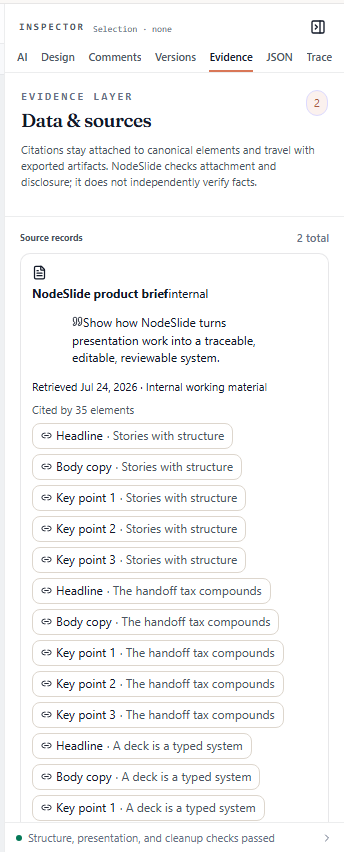
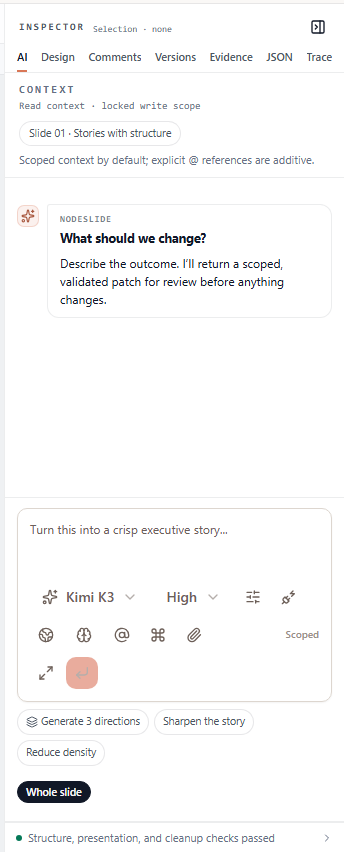
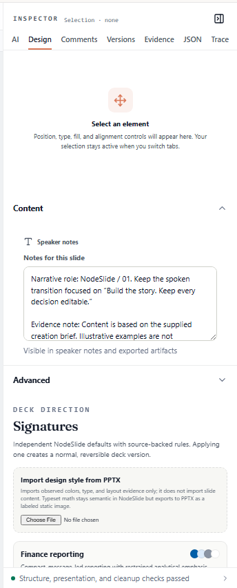
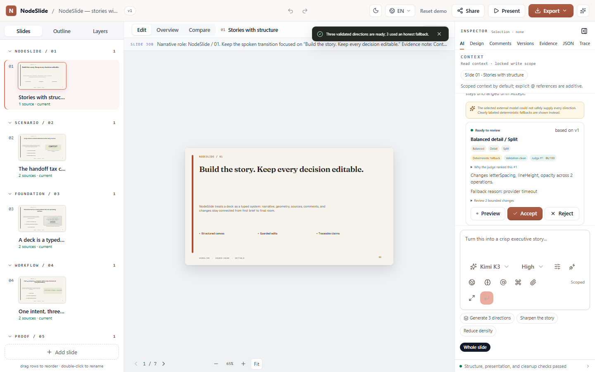

# Product surface audit — what NodeSlide already does

Measured against the running production app at `nodeslide.vercel.app` on 2026-07-24, not against
the source and not against a design thread.

This file exists because of a repeated error. Three times I searched the source for an identifier,
failed to find it, and reported the **concept** as absent. Twice the concept was already shipping
under a different name. A design thread then planned around my wrong report.

The rule this file enforces: **check the running product before you build.** A grep over source is
not a check. A label in the interface and an identifier in the code are different things, and the
gap between them is where the error lives.

## The inspector tabs

Seven tabs ship. The label a user reads is not always the identifier in the code.

| Interface label | `data-testid` | Panel heading | What it holds |
|---|---|---|---|
| AI | `inspector-tab-ai` | CONTEXT | Read context, locked write scope, scoped context by default |
| Design | `inspector-tab-design` | Select an element | Position, type, fill, alignment; selection survives a tab change |
| Comments | `inspector-tab-comments` | REVIEW TOGETHER | Anchor feedback to deck, slide, element, or bounding box |
| Versions | `inspector-tab-versions` | REVISION HISTORY | Compare snapshots, restore a revision, inspect proposals that missed their base clock |
| **Evidence** | **`inspector-tab-data`** | EVIDENCE LAYER | Data and sources; citations stay attached to canonical elements and travel with exports |
| JSON | `inspector-tab-json` | DECK AS CODE | The canonical `nodeslide.slidelang/v1` DeckSpec |
| Trace | `inspector-tab-trace` | AGENT ACTIVITY | Provider, work performed, validation, human approval in one auditable run |

**The Evidence row is the trap.** The label is `Evidence`. The identifier is `data`. I searched for
`Evidence`, did not find it, and told both the owner and the design thread that the tab was missing.
It ships.



The panel reads `EVIDENCE LAYER · Data & sources`, holds 2 source records, and shows one brief cited
by 35 elements. It also states its own limit: *"NodeSlide checks attachment and disclosure; it does
not independently verify facts."* That is an honest-claim line already in the product, and it is the
same discipline the gates enforce. Room-Ready's proof obligations belong beside it, not in a new tab.

## Features that already exist

The AI panel carries three actions:

- **Generate 3 directions**
- Sharpen the story
- Reduce density



`Generate 3 directions` is the three-candidate selection step. The design thread named that as a
missing product, and I was one step from building it. It ships. The same panel also carries a model
picker (`Kimi K3`), a reasoning-effort control (`High`), a `Whole slide` scope control, and the line
"I'll return a scoped, validated patch for review before anything changes".

Also present in the workspace: Slides / Outline / Layers navigation, Edit / Overview / Compare
modes, a `verified` badge, a model picker with a reasoning-effort control, Present, Share, Export,
undo and redo, a language switcher, and a status line reading "Structure, presentation, and cleanup
checks passed".

## Two different "directions", and I flattened them into one

Saying "`Generate 3 directions` ships" was itself too strong. The product has **two** direction
surfaces, at two different scopes, and the design thread only ever asked about the second.

| | Slide directions | Deck direction |
|---|---|---|
| where | AI tab, `Generate 3 directions` | Design tab → Advanced → `DECK DIRECTION` |
| scope | one slide | the whole deck |
| offers | three generated, judged, ranked branches | named signatures — `Finance reporting`, `Startup narrative` |
| backed by | `NodeSlideCompositionVariant` | `SignatureProfile` |

The design thread had already diagnosed this correctly: the three variations are slide-level, not
deck-level. My correction handed that diagnosis back as if it were wrong. It was not.



### What the slide generator actually does

Clicked on production, waited out the run, photographed the result. It generates three named
branches (`Balanced detail / Split`, `Story-first / Headline`), validates each, and ranks them with
a judge score and a stated reason. It reports its own degradation rather than hiding it:

> The selected external model could not safely supply every direction. Clearly labeled
> deterministic fallbacks are shown instead.

and per branch, `Fallback reason: provider timeout`, with `Deterministic fallback` and
`Validation clean` as separate chips. That is the same honesty rule the gates enforce, already in
the product.



Accepting one is durable. The version badge moves v1 → v2, and Versions records
`Variation balanced/detail/split: Restyle element_7b69…; Restyle element_c19e…` as `v2 · Agent`.

### Is it governing? Yes — and my test said no, wrongly

The thread set the test: after choosing A, does an edit that is *legitimate under B* get flagged as
violating A? It also named the trap — do not test with an obviously bad edit, because a generic
quality check would catch that without remembering any choice.

I ran it on production, saw no active direction after reload, and reported **state A: the choice is
recorded but not enforced**. That was wrong, and the thread caught it by pointing at the repository.

The enforcement is real and it is server-side:

| Piece | Where |
|---|---|
| commitment fields on the deck | `activeSignatureProfileId`, `activeSignatureProfileDigest` — `shared/nodeslide.ts:597`, `convex/schema.ts:267` |
| the transition that creates it | `activateProfile` — writes id + source digest, bumps `deck.version`, validates the snapshot against the profile |
| **enforcement on later edits** | `convex/nodeslide.ts:943` — if a deck has an active profile, the patch is previewed and the *result* is validated against that profile before it may commit |

And the refusal message is the thread's step 5, already written:

> This direction conflicts with the active signature profile. Generate new directions and review again.

**Why my test could not have found this.** I applied a *slide variation* and never applied a deck
signature. So `activeSignatureProfileId` was never set, the guard at `nodeslide.ts:943` was skipped
entirely, and I read the resulting silence as absence. Wrong instrument, then a conclusion drawn from
a code path that never ran.

### The real gap is observability, not enforcement

What remains true from the test: after reload the running product **never names the active
direction**. The word "direction" survives only in the generator's heading and its fallback banner.
So the commitment exists, is bound to an immutable digest, and blocks conflicting edits — and a
person looking at the deck cannot tell any of that.

That is a much narrower piece of work than "build the commitment", and it is the piece worth doing:
surface the active direction, and surface the refusal when one is hit.

### What Restore does, read twice and independently

I read the restore path from the code; the design thread was answering the same question at the same
time without seeing my read. Both reads agree on the mechanism:

`restoredSnapshot` (`convex/nodeslide.ts:5035`) clones `target.deck` wholesale and overrides only
identity and new-write fields — id, projectId, createdAt, updatedAt, version, status, shareSlug. The
signature binding is **not** in that list, so the target version's binding — or its absence — is what
survives. `writeNodeSlideSnapshot` then patches those same two fields onto the deck row.

So restoring a version from before an activation removes the deck's governance.

My instinct was that this is a defect: a bypass, since you could reach a forbidden state by restoring
to it instead of editing to it. The thread supplied the reasoning I was missing, and it is right —
restore must carry governance with content, because preserving the *current* signature over
*restored* content would produce a hybrid state that never historically existed. Old versions stay
accurate about what governed at their point in time.

What is genuinely wrong is that it happens in silence:

> The behavior is internally correct but can still be operationally silent because the commitment is
> not prominently visible.

## The work this audit actually justifies

Both sources agree on two small pieces, and on what not to build:

1. **A persistent indicator in the Design tab**, rendered directly from the current snapshot's
   `activeSignatureProfileId` and `activeSignatureProfileDigest` — the same fields the server already
   enforces on. **Add no new persistent state**: a second store could disagree with the deck row, and
   then the visible answer and the enforced answer differ, which is worse than showing nothing.
2. **A governance diff in the restore confirmation**, disclosing that restoring a pre-activation
   version drops the active direction, *before* the restore is accepted.

Versions is the wrong primary surface. It answers "what happened at a prior version"; the indicator
must answer "what governs this deck now".

## A test that proved nothing, and nearly became a finding

The first run of this test loaded the deck in a brand-new browser context and reported that no
direction survived. That was wrong. The page it measured was a refusal:

> **This is an editor link, not a share link.** Raw deck IDs do not grant access.

Deck ownership is bound to the browser, so a fresh context cannot open the deck at all. The test had
measured an access wall and called it a missing feature. Re-run in the same browser — which is what
a user closing a tab actually does — the workspace reopened at v2 with the choice intact.

Worth recording as a product fact too: a raw deck id grants nothing, and the refusal page says so
plainly and offers recovery.

## The error class, five times now

Every wrong claim in this document has the same shape. I look for a thing, fail to find it *where I
looked*, and report the thing as absent.

| # | Claim | Reality | What I actually searched |
|---|---|---|---|
| 1 | `DeckDirection` absent | ships as `SignatureProfile` | the identifier |
| 2 | Evidence tab absent | ships, labelled Evidence, coded `data` | the label in source |
| 3 | three-direction selection absent | ships as `Generate 3 directions` | source, not the app |
| 4 | that button closes the deck-direction gap | wrong scope — it is slide-level | the app, not the scope |
| 5 | the choice is not enforced | enforced at `convex/nodeslide.ts:943` | a code path I never triggered |

Note the drift. Fixing #1–#3 by "check the running product" produced #4 and #5, which are errors of
*checking the wrong thing carefully*. The rule is not "prefer the app to the source". The rule is:
**name the exact mechanism you expect, then confirm you actually exercised it.** My last test
concluded from a guard that never ran.

## What this changes

Before building any part of Room-Ready or direction selection, check these against the running app:

1. Deck direction already ships as `SignatureProfile` signatures with Preview and Apply, **and is
   already enforced on later edits**. The gap is that none of it is visible.
2. The Evidence tab already exists. Room-Ready's proof obligations may belong there, not in a new tab.
3. `Versions` already handles revisions and proposals, and is where an applied direction lands
   today — so it overlaps whatever a selection receipt would record.

## How to reproduce this audit

```bash
node scripts/capture-ui.mjs --url "https://nodeslide.vercel.app/" \
  --clickText "Explore the editable sample workspace" --out shot.png
```

Click a tab by its identifier, not its label: `[data-testid="inspector-tab-data"]`.

## The local environment cannot do this

`convex dev` fails with "You don't have access to the selected project". The deployment named in
`.env.local` answers 404 on every endpoint, and the workspace socket closes with code 1000 and
retries forever. The landing page and the Atlas gallery render locally. The workspace does not.

Capture production for workspace evidence until local Convex access is restored.
